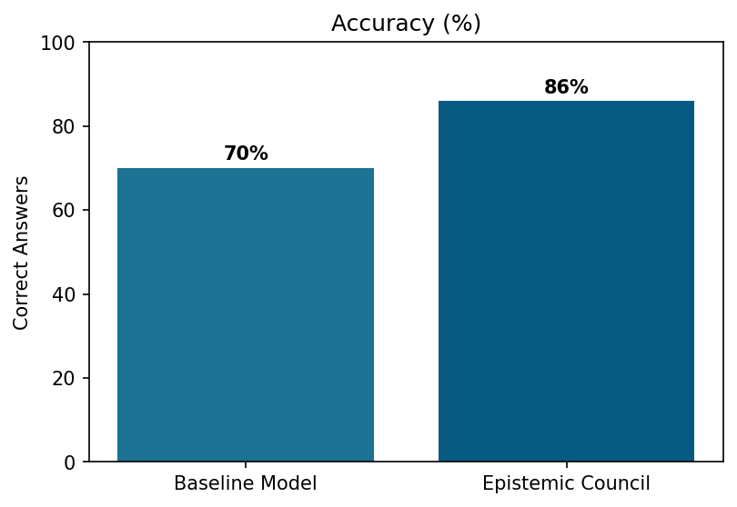
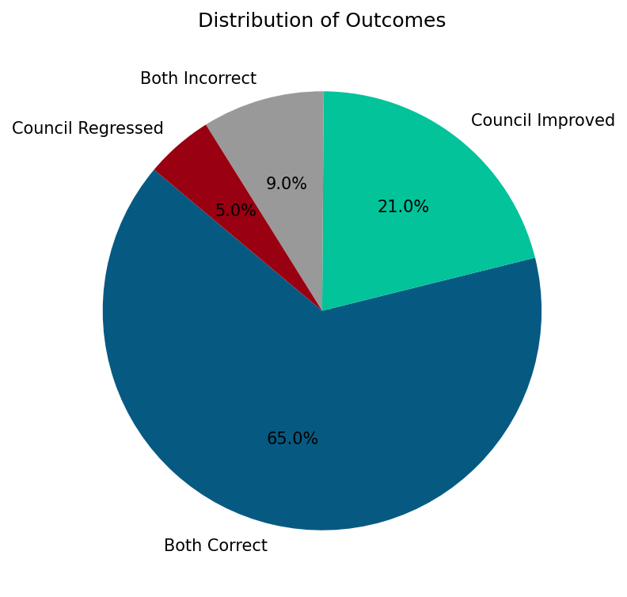
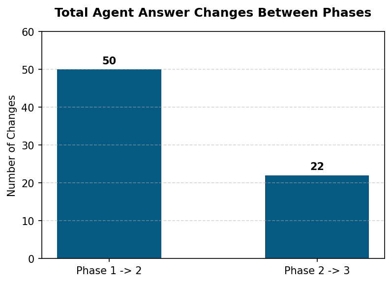
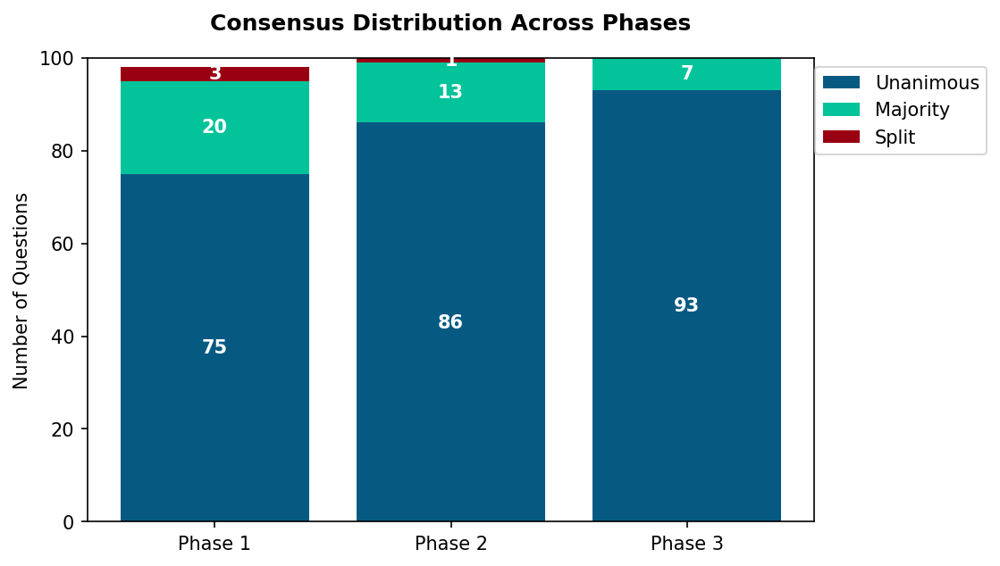
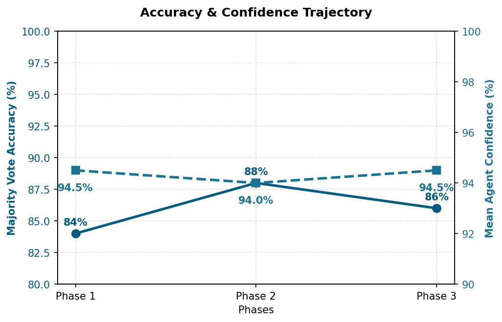
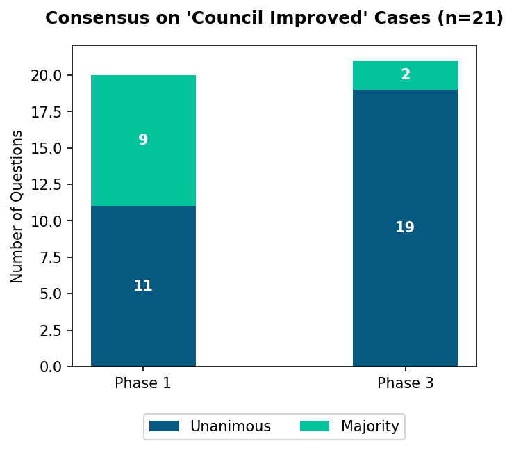
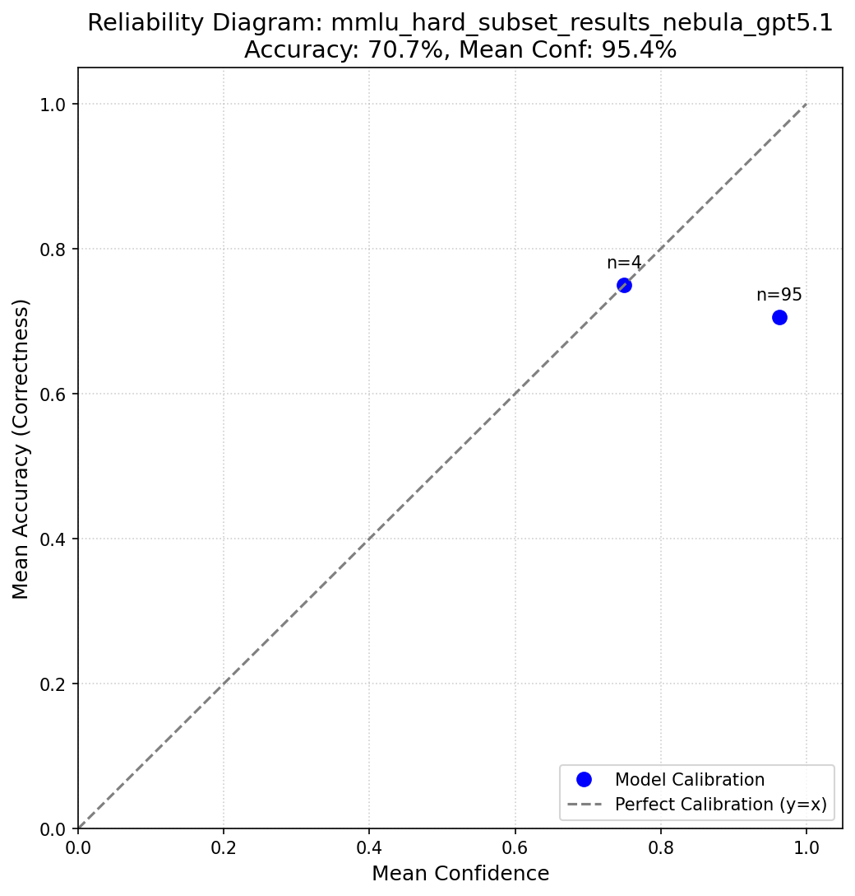
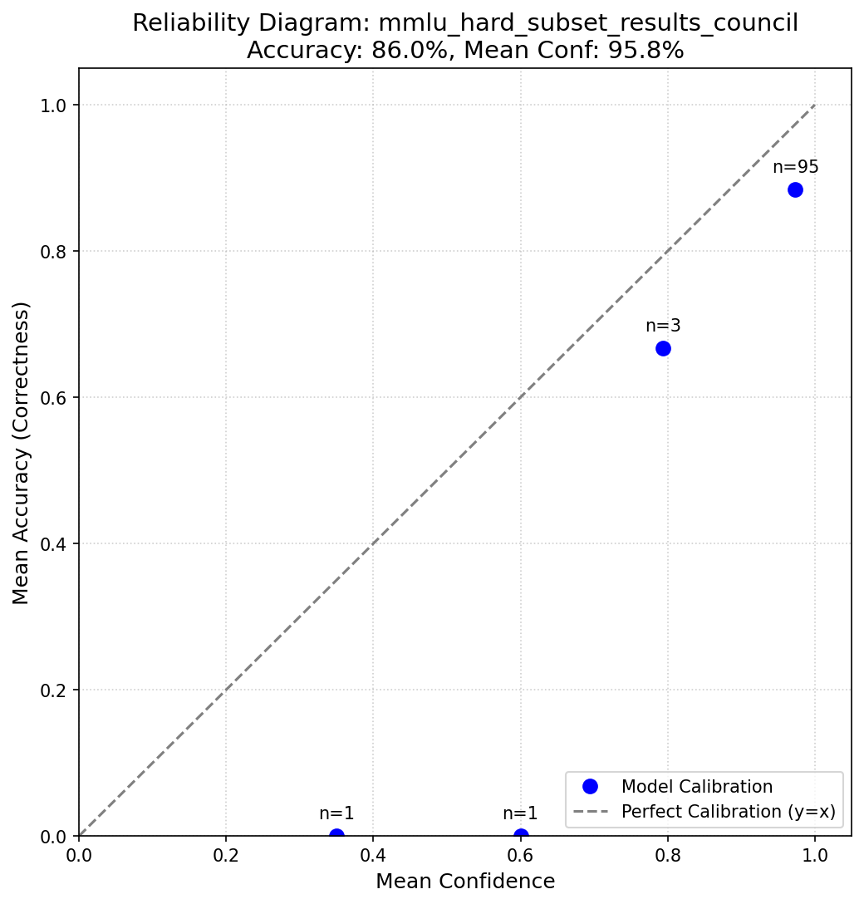

  <h1>🏛️ Epistemic Council MMLU Evaluation</h1>
  
<em>A comparative analysis between a single-agent language model (baseline) and a multi-agent "Epistemic Council" architecture on the Massive Multitask Language Understanding (MMLU) hard subset.</em>

---

## 🔬 Experiment Setup

The Epistemic Council architecture utilizes five distinct agents, each explicitly prompted to operate under a specific philosophical framework, alongside an Orchestrator agent to synthesize debate and calibrate final confidence.

*   **Rationalist:** Focuses on logical necessity, formal syllogisms, and deduction. 
*   **Empiricist:** Builds knowledge strictly through measurement, observation, and falsifiability checks.
*   **Coherentist:** Evaluates truth based on systemic dependencies and holistic fit within a "Web of Belief."
*   **Pragmatist:** Measures truth by practical outcomes, utility delta, and "what works."
*   **Standpoint:** Challenges universal claims by tracing epistemic genealogy and analyzing power dynamics.

### 🔄 The 4-Phase Debate Process

1.  **Independent Opening (Phase 1):** All 5 agents evaluate the question and provide an initial answer in parallel, with no cross-talk.
2.  **Critique Round 1 (Phase 2):** Agents review the Phase 1 transcript, actively critiquing the logic and evidence of their peers while defending their own epistemic position.
3.  **Critique Round 2 (Phase 3):** Agents review the accumulated debate transcript and submit their final, revised verdict and confidence score.
4.  **Consensus Resolution (Phase 4):** A majority vote is taken based on Phase 3 answers. If the council is split without a majority, the Orchestrator steps in to mediate and break the tie based on the strength of the preceding arguments.

---

## 🏆 Key Findings

The Epistemic Council architecture demonstrated a significant improvement over the baseline model on the exact same 100 difficult MMLU questions.

### Performance Comparison

  
  

*   **Baseline Accuracy:** 70%
*   **Council Accuracy:** 86%
*   **Net Improvement:** +16%

**Outcome Breakdown:**
*   **Both Correct:** 65 questions
*   **Council Improved:** 21 questions (Baseline was wrong, Council got it right)
*   **Council Regressed:** 5 questions (Baseline was right, Council got it wrong)
*   **Both Incorrect:** 9 questions

---

## 📈 Phase-wise Analysis: Debate Evolution

Tracking how the agents changed their minds and converged on a solution shows the power of structured peer critique.

  
  

### 1. Changing Minds
As the debate progresses through rounds, agents adjust their positions in response to peer critiques. Most minds are changed after the initial independent round.
* Out of ~500 individual agent answers per phase, **10%** changed from P1 to P2, and only **4.4%** from P2 to P3 as positions solidified.

### 2. Growth of Consensus
The council naturally converges toward unanimity. By Phase 3, there were zero split decisions, negating the need for an Orchestrator tiebreak.
* **Phase 1:** 75 Unanimous, 20 Majority, 3 Split
* **Phase 3:** 93 Unanimous, 7 Majority, 0 Split

### 3. Accuracy & Confidence Trajectory

  

While accuracy peaks slightly in Phase 2 (88%), Phase 3 normalizes at 86% as agents lock in their final positions. Average confidence stays steadily high (>94%).

---

## 🔎 Deep Dive: 'Council Improved' Cases

Analyzing the 21 questions where the baseline model failed but the Council succeeded reveals the power of the diverse framework.

  

*   **Strong Initial Performance:** Even in Phase 1 (independent reasoning), the Council achieved an 81% majority accuracy on these difficult questions.
*   **Solidifying Correctness:** Unanimous agreement on these 21 questions grew from 11 in Phase 1 to 19 in Phase 3.
*   **The Power of Diverse Frameworks:** Enforcing distinct epistemic constraints (Rationalist, Empiricist, etc.) prevented the "echo chamber" effect seen in the single baseline model.

---

## 🎯 Model Calibration & Reliability

The Orchestrator explicitly calibrates confidence scores based on the council consensus and debate margins. The reliability diagrams below map the mean accuracy of the models against their mean reported confidence.

  <figure style="display: inline-block; width: 45%;">
    
    <figcaption><strong>Baseline Agent</strong></figcaption>
  </figure>
  <figure style="display: inline-block; width: 45%;">
    
    <figcaption><strong>Council Agent</strong></figcaption>
  </figure>

---

## 📂 Repository Contents

*   `run_mmlu_eval.py`: Standard baseline evaluation script.
*   `run_mmlu_eval_council.py`: Orchestrates the 4-phase debate process.
*   `council_orchestrator.py`: Definitions of the system prompts and orchestration logic.
*   `mmlu_hard_subset.csv`: The input questions.
*   `mmlu_hard_subset_results_nebula_gpt5.1.csv`: The baseline outputs.
*   `mmlu_hard_subset_results_council.csv`: The final council outputs.
*   `mmlu_hard_subset_council_phaselog.csv`: The raw transcript of all agent votes and text across all phases.
*   `mmlu_comparison_baseline_vs_council.csv`: Side-by-side comparison categorizing the outcomes.
