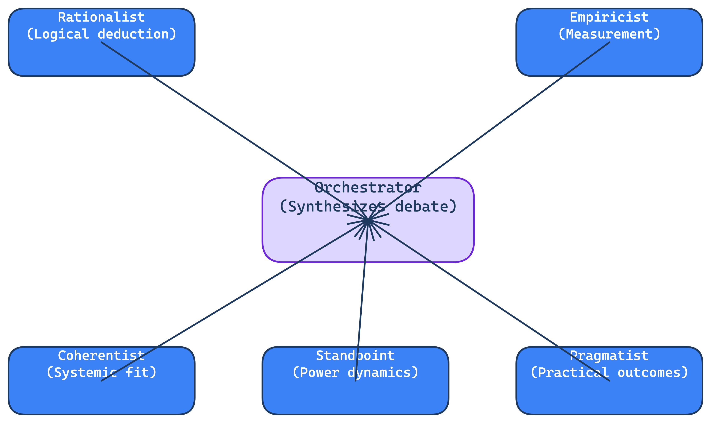
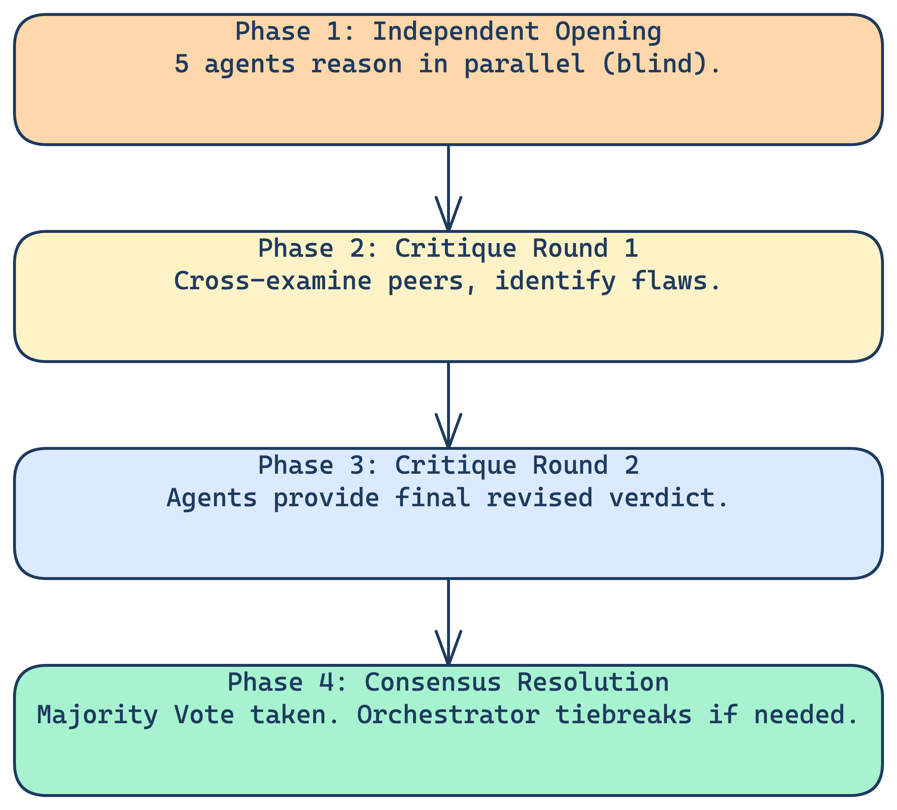
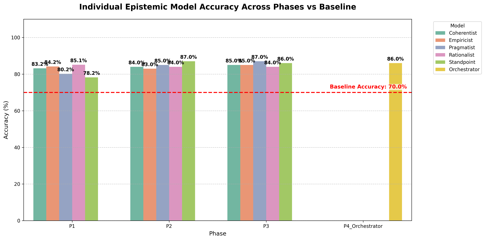

<div align="center">
  <h1>🏛️ Epistemic Council MMLU Evaluation Report</h1>
  <p><em>A comparative analysis between a single-agent language model (baseline) and a multi-agent "Epistemic Council" architecture on the Massive Multitask Language Understanding (MMLU) hard subset.</em></p>
</div>

---

## 📑 Table of Contents
1. [Introduction & Methodology](#1-introduction--methodology)
2. [High-Level Results](#2-high-level-results)
3. [Deep-Dive Analysis](#3-deep-dive-analysis)
4. [Case Studies: Wins vs. Regressions](#4-case-studies-wins-vs-regressions)
5. [Model Calibration & Conclusion](#5-model-calibration--conclusion)

---

## 1. Introduction & Methodology

This evaluation compares the performance of a standard baseline Language Model against an innovative 'Epistemic Council' multi-agent architecture when answering complex questions from the MMLU hard subset.

### 1.1 Epistemological Frameworks & Agent Architecture
The evaluation utilizes a council of 5 distinct epistemic agents, each operating under a different philosophical framework, alongside an Orchestrator model.

*   **Rationalist:** Focuses on logical necessity and formal syllogisms. Sensory data is deceptive; truth is found via deduction.
*   **Empiricist:** Builds knowledge strictly through measurement, observation, and induction. Performs falsifiability checks.
*   **Coherentist:** Evaluates truth based on the 'Web of Belief' and systemic dependencies. Focuses on holistic fit.
*   **Pragmatist:** Measures truth by 'cash value' in action and utility delta. Focuses on what works and practical outcomes.
*   **Standpoint:** Challenges 'universal' claims by tracing epistemic genealogy and historical power dynamics.

<div align="center">
  
</div>

### 1.2 The 4-Phase Debate Process
The evaluation runs over a structured 4-phase debate workflow to synthesize a final conclusion:

1.  **Independent Opening:** 5 agents answer in parallel (blind, no cross-talk). Each reasons through the question using their framework.
2.  **Critique Round 1:** Agents review the Phase 1 transcript. They critique the logic and evidence of others while defending their own position.
3.  **Critique Round 2:** Agents review the full Phase 1+2 transcript and provide their final, revised verdict and confidence score.
4.  **Consensus Resolution:** Majority vote is taken. If no majority, Orchestrator mediates and tiebreaks based on all arguments.

<div align="center">
  
</div>

---

## 2. High-Level Results

### 2.1 Baseline vs. Council Performance Overview
The Epistemic Council architecture demonstrated a significant improvement over the baseline model, moving from **70% baseline accuracy** to **86% final accuracy (+16%)**.

**Outcome Distribution:**
*   **Council Improved:** 21 questions (Baseline was wrong, Council got it right)
*   **Council Regressed:** 5 questions (Baseline was right, Council got it wrong)
*   **Both Correct:** 65 questions
*   **Both Incorrect:** 9 questions

<div align="center">
  
  
</div>

### 2.2 Accuracy & Confidence Trajectory
While accuracy peaks slightly in Phase 2 (88%), Phase 3 normalizes at 86% as agents lock in their final positions. Average confidence stays steadily high (>94%).

<div align="center">
  
</div>

### 2.3 Debate Evolution & Consensus Growth
As the debate progresses through rounds, agents adjust their positions in response to peer critiques. Most minds are changed after the initial independent round.

*   Out of ~500 individual agent answers per phase, 10% changed from Phase 1 to Phase 2, and only 4.4% from Phase 2 to Phase 3 as positions solidified.
*   The council naturally converges toward unanimity. By Phase 3, there were zero split decisions, negating the need for an Orchestrator tiebreak.

<div align="center">
  
  
</div>

---

## 3. Deep-Dive Analysis

### 3.1 Performance Shifts by Subject Area
The overall change resulted in 21 improvements versus 5 regressions. Examining performance by subject reveals distinct areas of strength and weakness for the council model.

| Subject | Improved | Maintained Correct | Maintained Incorrect | Regressed | Net Gain | Total |
| :--- | :---: | :---: | :---: | :---: | :---: | :---: |
| **Biology** | 2 | 9 | 0 | 1 | +1 | 13 |
| **Chemistry** | 1 | 1 | 1 | 0 | +1 | 4 |
| **Computer Science** | 8 | 20 | 3 | 1 | +7 | 39 |
| **Mathematics** | 6 | 6 | 1 | 0 | +6 | 19 |
| **Medicine** | 2 | 28 | 4 | 3 | -1 | 36 |
| **Physics** | 2 | 1 | 0 | 0 | +2 | 5 |

**Key Insight:** The Council thrives most in deterministic, logic-heavy fields (Math, CS), but can occasionally introduce noise in subjects requiring pure factual recall without systemic dependencies.

### 3.2 Phase-by-Phase Subject Evolution
A detailed analysis of phase-wise performance by subject demonstrates how the Council's accuracy evolved during the debate compared to the baseline:

| Subject | Baseline Correct | Phase 1 Correct | Phase 2 Correct | Phase 3 Correct | Total Questions |
| :--- | :---: | :---: | :---: | :---: | :---: |
| **Biology** | 10 | 11 | 11 | 11 | 12 |
| **Chemistry** | 1 | 1 | 2 | 2 | 3 |
| **Computer Science** | 21 | 30 | 29 | 28 | 32 |
| **Mathematics** | 6 | 9 | 12 | 12 | 13 |
| **Medicine** | 31 | 29 | 30 | 30 | 37 |
| **Physics** | 1 | 3 | 3 | 3 | 3 |

<div align="center">
  
</div>

---

## 4. Case Studies: Wins vs. Regressions

### 4.1 The Wins (Council Improvements)
*   **Total Improved:** 21 Questions.
*   **Top Areas:** Computer Science (8), Mathematics (6), Biology (2).

**Driver of Success:**
The baseline model frequently struggled with questions requiring synthesis of multiple logical steps. The Council's diverse epistemic constraints—specifically Empiricist falsifiability checks and Coherentist systemic analysis—prevented single-point logical failures and guided the group to the correct synthesis.

**Example (Computer Science):**
Question regarding complex network interconnectivity alternatives.
*   **Baseline:** Chose C (Failed to account for all constraints)
*   **Council:** Chose D (Correctly deduced the valid architecture through debate)

<div align="center">
  
</div>

### 4.2 The Misses (Council Regressions)
*   **Total Regressed:** 5 Questions.
*   **Top Areas:** Medicine (3), Biology (1), Computer Science (1).

**Driver of Failure (Overthinking):**
Regressions generally occurred when dealing with straightforward factual or applied-scenario recall. The debate process—driven heavily by Pragmatist 'cash value' checks and Standpoint skepticism—sometimes introduced excessive doubt into an already correct premise, swaying consensus away from the true answer.

#### Error Analysis: The 5 Regressed Questions
These 5 questions were answered correctly by the Baseline model, but incorrectly by the Council after debate:

| Subject | Question | Options | True | Base | Council |
| :--- | :--- | :--- | :---: | :---: | :---: |
| **Medicine** | While working on a scene for an action movie, a sound technician is given the task of changing the frequency of a gunshot... | A: 941 Hz<br>B: 787 Hz<br>C: 924 Hz<br>D: 912 Hz | C | C | B |
| **Medicine** | A local politician starts a task force to reduce prejudice... recommendations are based on: I. Self-esteem II. Contact III. Hypothesis IV. Legal hypothesis | A: I, II, III<br>B: II, III, IV<br>C: I, III, IV<br>D: I, II, IV | D | D | B |
| **Medicine** | If a reaction was provided with 84g of ethane and unlimited oxygen, how many grams of carbon dioxide would result (C2H4 + O2 —> CO2 + H2O)? | A: 78g<br>B: 528g<br>C: 264g<br>D: 156g | C | C | D |
| **Computer Science** | Company X shipped 5 chips (1 defective), Company Y shipped 4 (2 defective). If a chosen chip is defective, what is the probability it came from Y? | A: 1/9<br>B: 4/9<br>C: 1/2<br>D: 2/3 | D | D | C |
| **Biology** | Binding of ZP3 receptors to ZP3 initiates sperm's acrosomal reaction. All of the following experimental observations would be expected EXCEPT: | A: Injecting eggs with antibodies... | A | A | D |

---

## 5. Model Calibration & Conclusion

### 5.1 Model Calibration & Reliability
The Orchestrator agent explicitly calibrates confidence scores based on council consensus. The reliability diagrams below demonstrate the mean accuracy mapped against mean confidence for the baseline model compared to the Epistemic Council.

<div align="center">
  <figure style="display: inline-block; width: 45%;">
    
    <figcaption><strong>Baseline Agent Calibration</strong></figcaption>
  </figure>
  <figure style="display: inline-block; width: 45%;">
    
    <figcaption><strong>Epistemic Council Calibration</strong></figcaption>
  </figure>
</div>

### 5.2 Orchestrator Role & Final Conclusion

#### Zero Tiebreaks Required
Because the Council reached unanimous or majority agreement on all 100 questions by Phase 3, the Orchestrator was never forced to break a split decision. Its primary role became synthesizing the arguments and calibrating final confidence.

#### Final Takeaways
*   **Debate improves reasoning:** Moving from 70% baseline to 86% final accuracy.
*   **Convergence over time:** Agents actively update their priors based on cross-examination, increasing unanimous agreement from 75 to 93.
*   **Early indicators of success:** Even the difficult questions were largely solved in the first independent phase (81% accuracy on the 21 'Improved' questions).

---

## 📂 Repository Contents

*   `run_mmlu_eval.py`: Standard baseline evaluation script.
*   `run_mmlu_eval_council.py`: Orchestrates the 4-phase debate process.
*   `council_orchestrator.py`: Definitions of the system prompts and orchestration logic.
*   `mmlu_hard_subset.csv`: The input questions.
*   `mmlu_hard_subset_results_nebula_gpt5.1.csv`: The baseline outputs.
*   `mmlu_hard_subset_results_council.csv`: The final council outputs.
*   `mmlu_hard_subset_council_phaselog.csv`: The raw transcript of all agent votes and text across all phases.
*   `mmlu_comparison_baseline_vs_council.csv`: Side-by-side comparison categorizing the outcomes.

## 🚀 How to Recreate the Experiment

1. **Run the Baseline Evaluation:**
   ```bash
   python run_mmlu_eval.py
   ```
   *This evaluates the standard language model on the `mmlu_hard_subset.csv`.*

2. **Run the Epistemic Council Evaluation:**
   ```bash
   python run_mmlu_eval_council.py
   ```
   *This executes the 4-phase debate process using the agents defined in `council_orchestrator.py`.*
